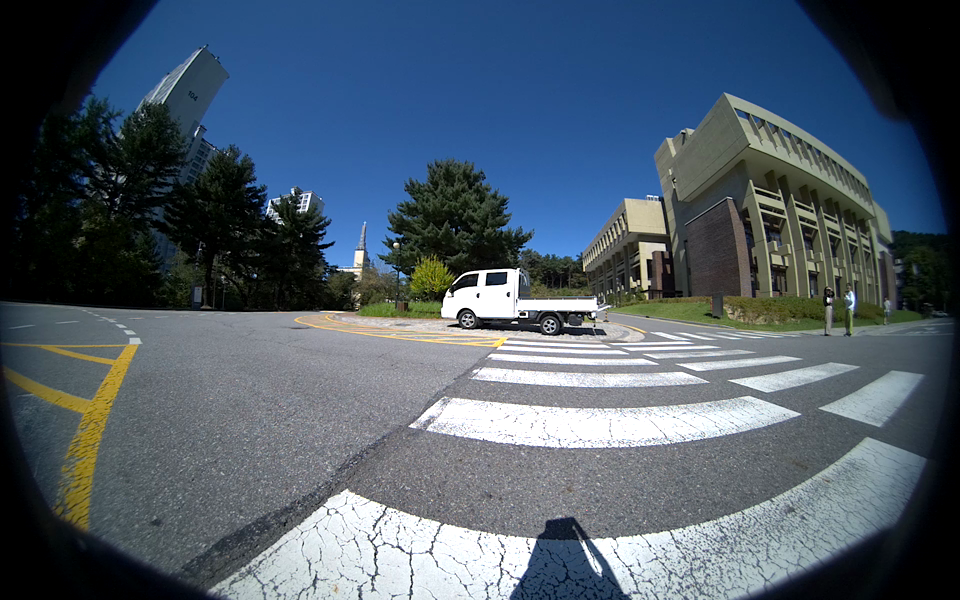
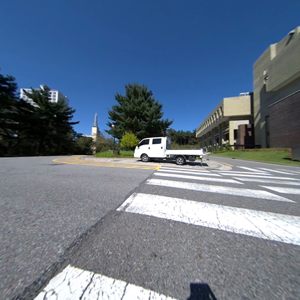
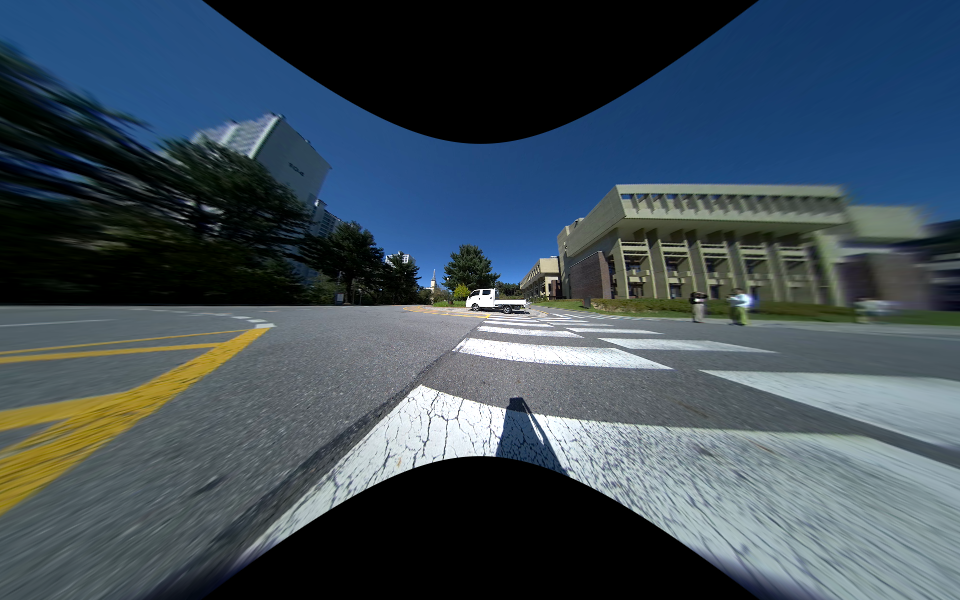

[](https://github.com/matsuren/dscamera/releases)
[](https://codecov.io/gh/matsuren/dscamera)
[](https://github.com/psf/black)

[](https://github.com/pre-commit/pre-commit)
[](https://pycqa.github.io/isort/)

# Double Sphere Camera Model

Python library of Double Sphere Camera Model for Supporting [Leopard Imaging Owl fisheye camera](https://leopardimaging.com/product/automotive-cameras/cameras-by-interface/maxim-gmsl-2-cameras/li-ar0234cs-gmsl2-owl/li-ar0234cs-gmsl2-owl/).

Reference:

```
V. Usenko, N. Demmel, and D. Cremers, "The Double Sphere Camera Model", Proc. of the Int. Conference on 3D Vision (3DV), 2018.
```

## Requirements
Python >= 3.6 with numpy and opencv.

## Installation
Run the following command.
```bash
git clone https://github.com/matsuren/dscamera
cd dscamera
python setup.py install
```

## Example LI Owl Fisheye Camera
Please check `example-li-owl` folder for fisheye image rectifications.

Input fisheye image:



Output zoom-in perspective image:



Output zoom-out perspective image:




## Camera calibration
Please use [Basalt](https://vision.in.tum.de/research/vslam/basalt) for fisheye camera calibration. The detail instruction is available [here](https://gitlab.com/VladyslavUsenko/basalt/blob/master/doc/Calibration.md).


## Example
Please check `example` folder for fisheye image rectifications.

Input fisheye image:


Output perspective image:


Output equirectangular image:


